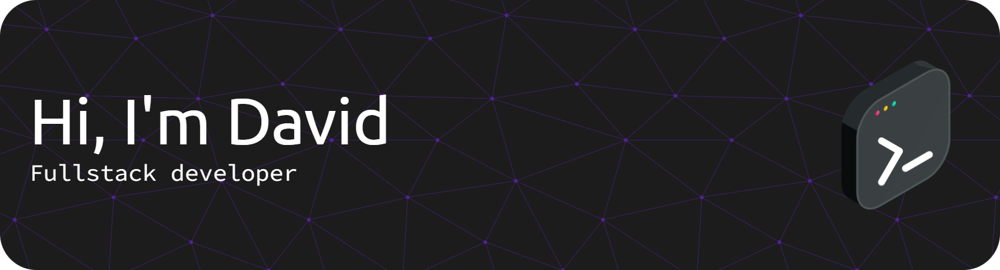

<header align="left">

<table align="left">
  <tr >
    <th>
      
  <a href="https://www.linkedin.com/in/dsun05/" />   LinkedIn
    </th> 
    <th>
      
  <a href="https://devpost.com/dsun05" />   Devpost
    </th> 
    <th>
      
  <a href="https://leetcode.com/u/dsun05/" />   Leetcode
    </th> 

  </tr>
  
</table>
</section>
</header>  
<section>  
 
 

### About me ☕
- Studies Cognitive Science and Linguistics and Computer Science at [UCLA](https://ucla.edu/).
- Currently working on: [KeystarVerse](https://dsun05.github.io/KeystarVerseFront/). (Demo)
- Hobbies: reading, gaming, and listening to music

